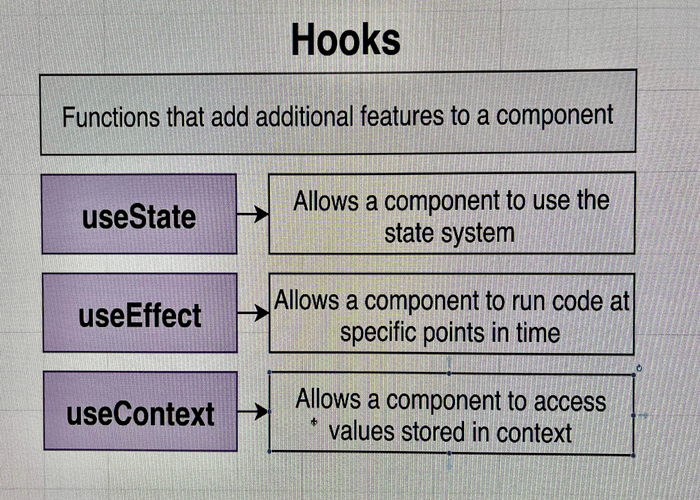
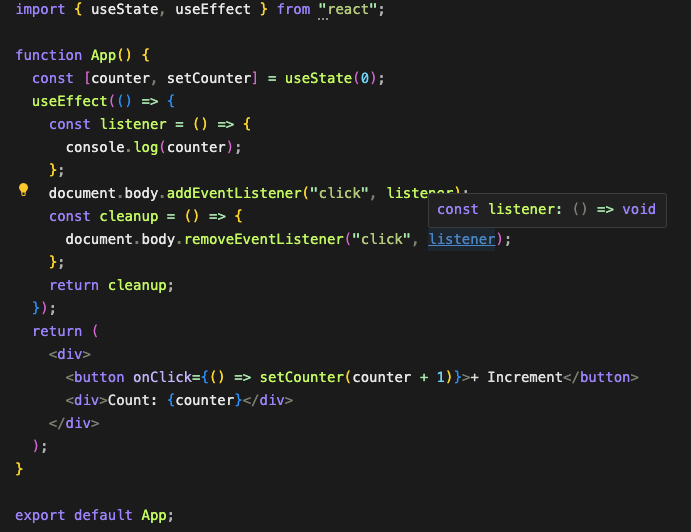

# React State methods uses Array destructuring

## A example of Array distructuring

```js
const ArrayDes = () => {
  return [1,2,3,4]
}
const [ firstElement, secondElement ] = ArrayDes()
console.log(firstElement, secondElement);

// Output: 1,2
```

## Event capturing and bubbling method

```js
const drop =  document.querySelector('.w-48')

const handleClick = (event) => {
    if (drop.contains(event.target)) {
        console.log('inside div')
    } else {
        console.log('outside div')
    }
}

document.addEventListener('click', handleClick , true)

```

## State Concepts


<div> <div/>
