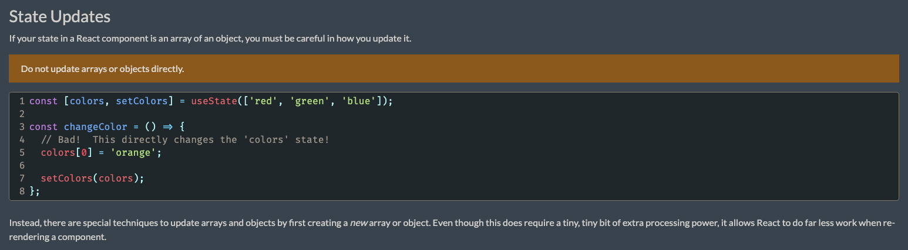
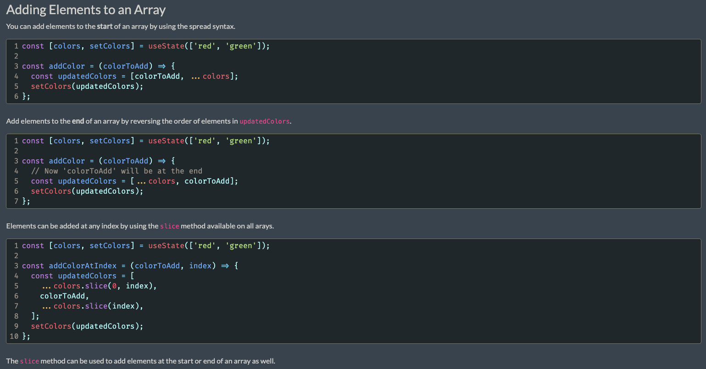
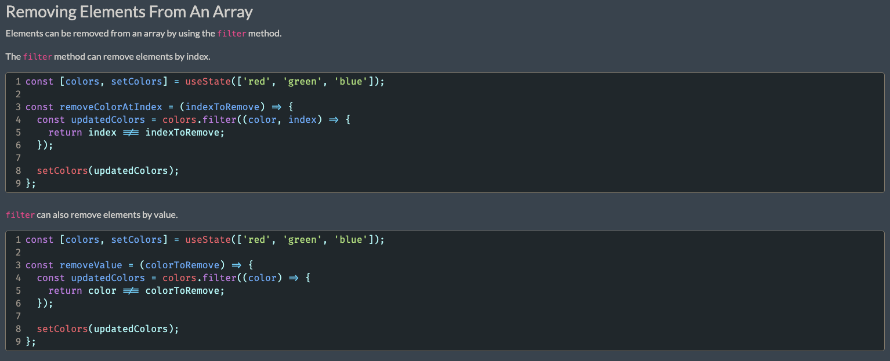
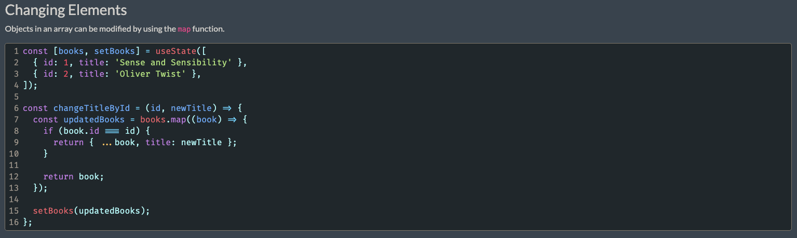
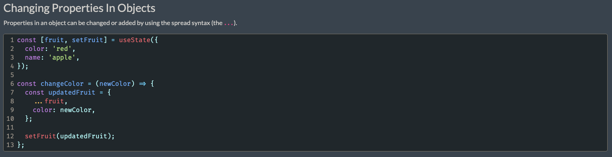
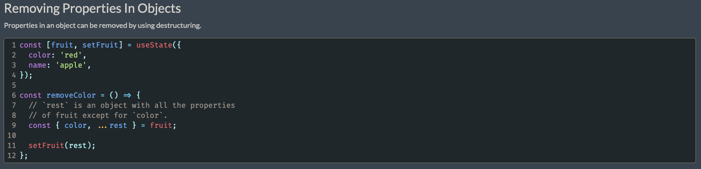

# React State methods uses Array destructuring

## A example of Array distructuring

```js
const ArrayDes = () => {
  return [1,2,3,4]
}
const [ firstElement, secondElement ] = ArrayDes()
console.log(firstElement, secondElement);

// Output: 1,2
```

## State Concepts







